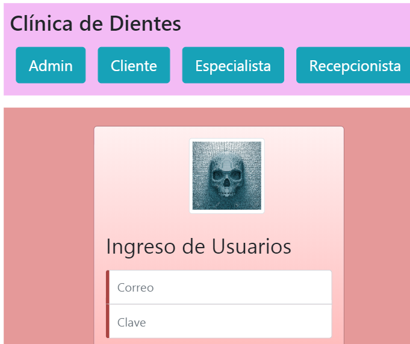
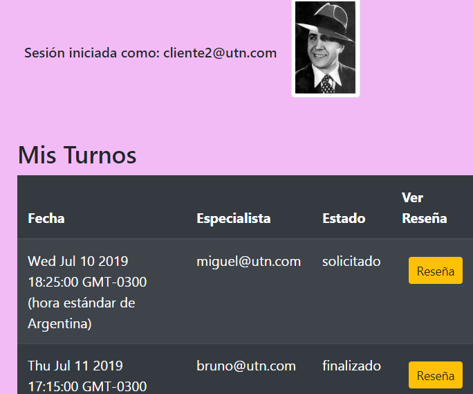

# Lab-IV-Sonrisa
Trabajo Práctico para la segunda parte de la materia

Es la primera parte de un sistema para una clínica odontológica.

Es necesario loguearse con un usuario para utilizarla.

El administrador puede dar de alta usuarios con imágenes y ver el listado de todos los usuarios registrados.

El cliente puede pedir un turno o revisar sus turnos pedidos y ver las reseñas del profesional de los turnos finalizados.

El especialista puede finalizar sus turnos y dejar una reseña para que el cliente la vea.

El cliente puede ver la reseña del especialista cuando el turno está finalizado y dejar una puntuación para el profesional que le atendió.

vea el progreso en: [Clínica Dental](https://clinicabuenas.firebaseapp.com)

